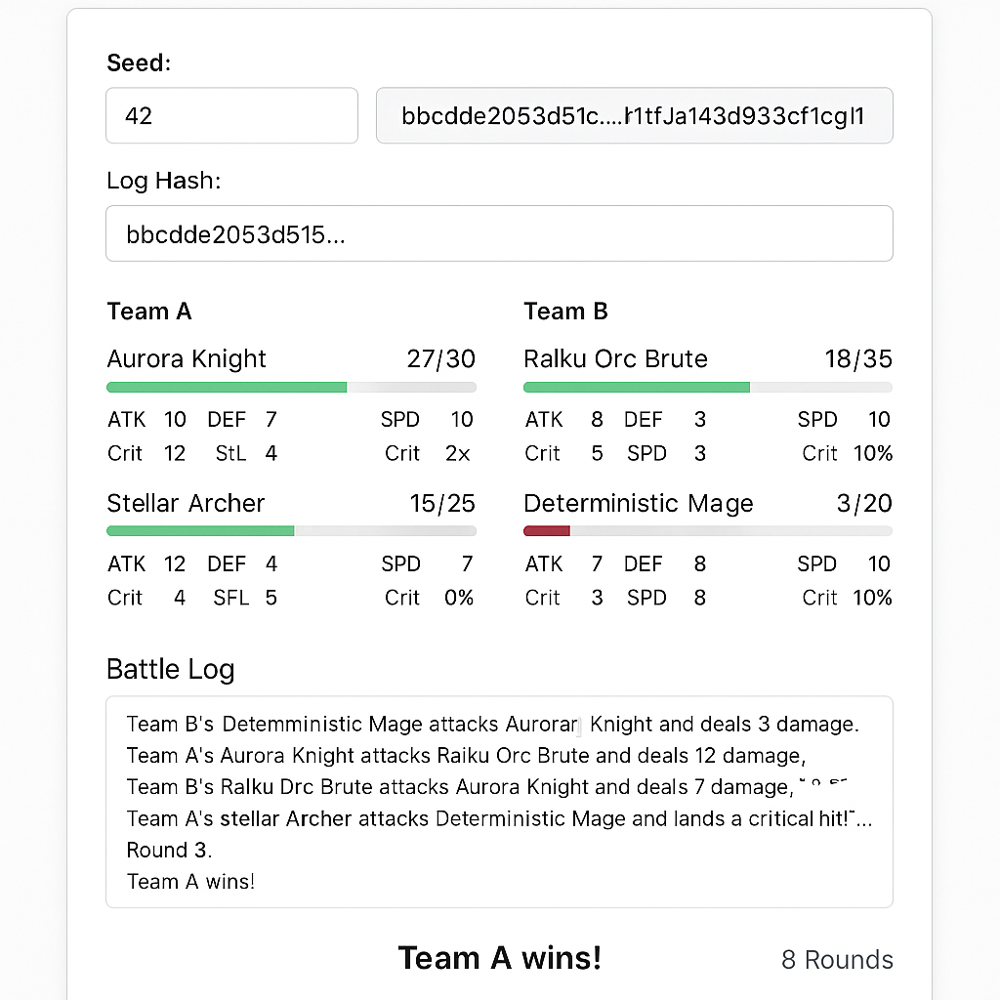

# Raiku Deterministic Battle Simulator

Deterministic execution is at the heart of Raiku's mission: enabling fair, reproducible, and verifiable compute flows at Solana scale.  
This repository contains a concept + prototype demonstrating how deterministic execution can power simulations, multi-agent systems, and verifiable workloads.

---

## 1. Overview

This project showcases a deterministic battle simulator driven entirely by a seeded pseudo-random generator.  
The system guarantees:

- 100% reproducibility  
- Platform-independent results  
- Pure deterministic logic  
- Verifiable battle logs via SHA-256 hashing  

The result is a working demonstration of how Raiku's deterministic execution paradigm can be used to create transparent, replayable, and provably correct simulations.

---

## 2. Problem Background

Games, AI agents, simulations, and compute pipelines are usually nondeterministic—making them difficult to audit or verify.  
Traditional randomness (`Math.random`, timing differences, environment quirks) makes outcomes inconsistent.

On-chain verification is expensive because storing or recomputing complete traces is impractical.

Raiku's deterministic execution guarantees allow:

- Reproducible simulations  
- Coordinated compute  
- Verifiable outcomes  
- Lightweight on-chain commitments  

This project demonstrates exactly that.

---

## 3. Solution: Deterministic Battle Simulator

### ✔ Seeded deterministic PRNG  

All decisions—turn order, damage, critical hits, target selection—are derived from a PRNG seeded by the user.

Same seed → same results.

### ✔ Verifiable trace commitment  

After simulation:

```
logHash = SHA256(JSON.stringify(log))
```

Anyone can replay the simulation with the same inputs and confirm that the resulting logHash matches.

### ✔ Pure deterministic engine  

No:

- `Math.random`  
- `Date.now`  
- External API  
- Side effects  

A fully deterministic state machine.

### ✔ Browser-based UI  

The `/web` folder includes a modern UI that:

- Accepts seed + configuration  
- Runs the deterministic simulation in-browser  
- Computes SHA-256 via Web Crypto  
- Shows battle steps, final HP, and the log hash  



---

## 4. Why This Fits Raiku's Mission

The simulator demonstrates Raiku's primitives:

- Deterministic compute scheduling  
- Verifiable replay  
- Reproducible execution  
- Clear separation between input → deterministic execution → proof(hash)

Potential real use cases:

- Fair PvP game simulations  
- AI-vs-AI agent tournaments  
- Off-chain compute with on-chain proof  
- Risk engines or simulations with deterministic replay  
- Multi-agent coordination models  

---

## 5. Architecture Summary

### Components:

- `/src`: Node/TS deterministic engine  
- `/web`: Browser UI implementing same deterministic logic  
- `logHash`: cryptographic commitment to the execution trace  

### Guarantees:

- Deterministic  
- Replayable  
- Verifiable  
- Stateless  

---

## 6. Future Extensions with Raiku

- Raiku Worker execution for large simulation batches  
- On-chain storage of logHash as canonical commitment  
- Deterministic AI agents  
- Zero-knowledge proof extensions  
- Multiplayer deterministic game engine  

---

## 7. Deliverables Alignment

This README serves as the **Concept Document (1–2 pages)** required by the bounty deliverables.

Project includes:

- Concept & architecture  
- Deterministic prototype  
- Visual UI demonstration  
- Verifiable trace hashing mechanism  

No SDK integration required (per contest rules).

---

## 8. Conclusion

The Raiku Deterministic Battle Simulator demonstrates how deterministic execution can make simulations fair, transparent, and verifiable.

It is a small but powerful example of how Raiku enables:

- provable correctness,  
- clear coordination,  
- and reproducible compute results in decentralized environments.
- 
tweet link : https://x.com/mereal03/status/1991819954023543179?s=20
